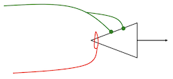
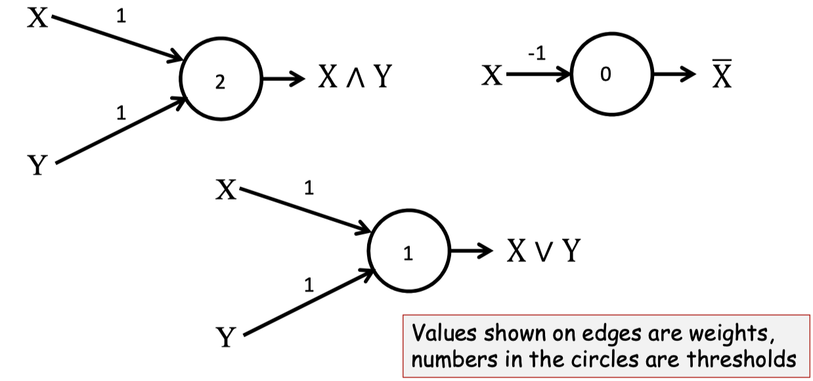
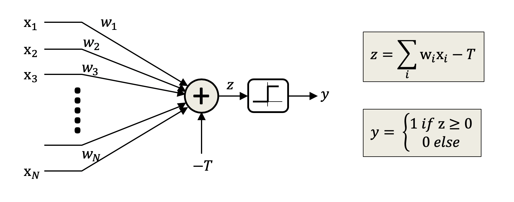
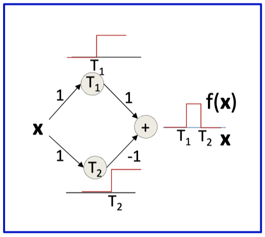
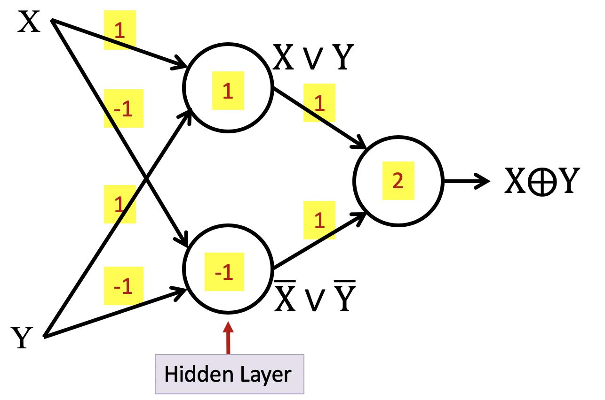
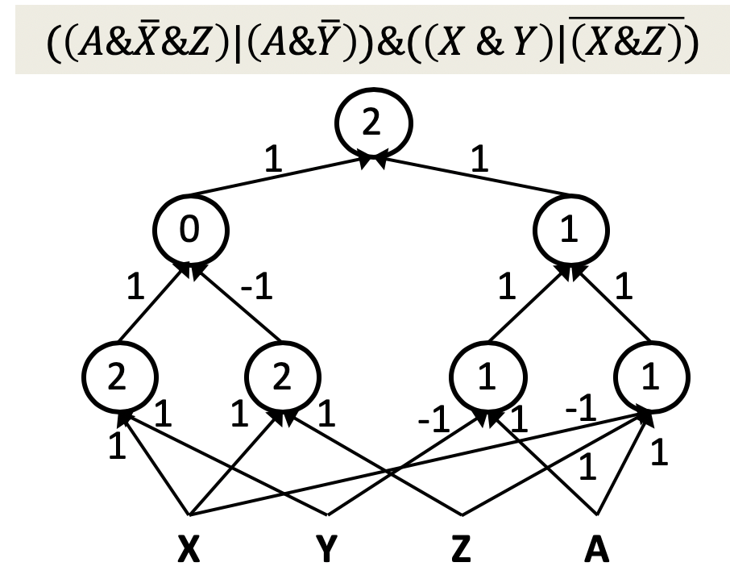
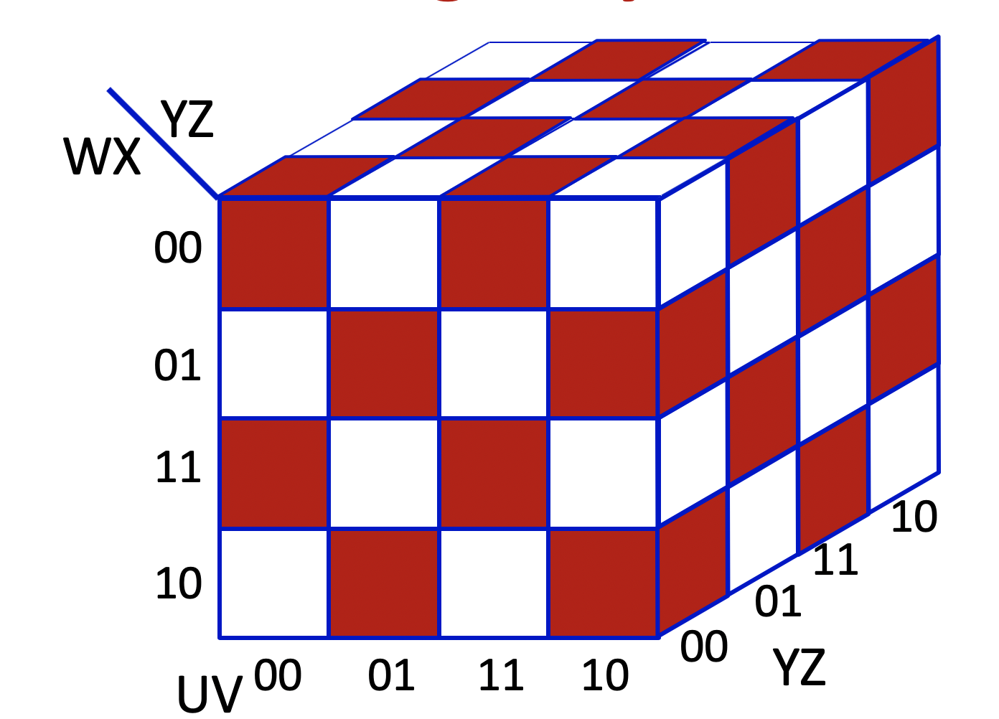

# WEEK1 - NOTES

## Amazon EC2

### Instance

Instances are classified based on machine size as: nano, micro, medium, large, xlarge, 2xlarge, …, 16xlarge

#### What do we put on EC2 Instances?

- Virtual images of existing machines 
  - You can create an image of your machine 
  - Transfer it to a different machine 
  - Save it as a backup

- Use cases
  - Software packages that are incredibly difficult to install 
  - Need to create multiple different machines with the exact same data for parameters servers 
  - Load balancing - create a new machine with the same AMI to be used in a different region depending on load

## Neural Networks

- Application fields
  - Image segmentation and recognition
  - Captions

## Turing’s Connectionist Machines

- Basic Model: A-type Machines
  - Networks of [NAND gates](https://en.wikipedia.org/wiki/NAND_gate)
- Connectionist: B-type Machines
  -  Connection between two units has a “modifier”
  -  If the green line is on, the signal sails through
  -  If the red is on, the output is fixed to 1
  -  “Learning” – figuring out how to manipulate the colored wires
     -  Done by an A-type machine

## Parallel Distributed Processing (PDP)

Requirements for a PDP system

- A set of processing units
- A state of activation
- An output function for each unit
- A pattern of connectivity among units
- A propagation rule for propagating patterns of activities through the network of connectivities
- An activation rule for combining the inputs impinging on a unit with the current state of that unit to produce a new level of activation for the unit
- A learning rule whereby patterns of connectivity are modified by experience
- An environment within which the system must operate

## Connectionist Systems

Requirements for a Connectionist Systems

- The connectivity of units
- The activation function of units
- The nature of the learning procedure that modifies the connections between units, and
- How the network is interpreted semantically

## Synaptic Model

- Excitatory synapse: Transmits weighted input to the neuron

- Inhibitory synapse: Any signal from an inhibitory synapse prevents neuron from firing
  - The activity of any inhibitory synapse absolutely prevents excitation of the neuron at that time.
    - Regardless of other inputs

## McCulloch and Pitts Model

- Could compute arbitrary Boolean propositions
  - Since any Boolean function can be emulated, any Boolean function can be composed

- Models for memory
  - Networks with loops can “remember”
  - Lawrence Kubie (1930): Closed loops in the central nervous system explain memory

## Hebbian Learning

Here, η is a learning rate coefficient, and x are the outputs of the `i`th and `j`th elements.

- Fundamentally unstable
  - Stronger connections will enforce themselves
  - No notion of “competition”
  - No reduction in weights
  - Learning is unbounded

- Number of later modifications, allowing for weight normalization, forgetting etc.

## Perceptron

 

- Easily shown to mimic any Boolean gate
- **BUT** No solution for XOR, and Not universal.

## Summary for Neural Network

- Neural networks began as computational models of the brain

- Neural network models are connectionist machines

    - The comprise networks of neural units

- McCullough and Pitt model: Neurons as Boolean threshold units

  - Models the brain as performing propositional logic

  - But no learning rule

- Hebb’s learning rule: Neurons that fire together wire together

  - Unstable

- Rosenblatt’s perceptron : A variant of the McCulloch and Pitt neuron with a provably convergent learning rule

  - But individual perceptrons are limited in their capacity (Minsky and Papert)

- Multi-layer

## MLP as a continuous-valued regression

1. A simple 3-unit MLP with a “summing” output unit can generate a “square pulse” over an input
   - Output is 1 only if the input lies between T 1 and T 2
   - T 1 and T 2 can be arbitrarily specified
2. An MLP with many units can model an arbitrary function over an input
   - To arbitrary precision
3. This generalizes to functions of any number of inputs (next class)

## Weight of perceptron

- The perceptron fires if the input is within a specified angle of the weight
- Neuron fires if the input vector is close enough to the weight vector.

### Weight and correlation

- If the correlation between the weight pattern and the inputs exceeds a threshold, fire
- The perceptron is a correlation filter!

## MLP 

Multi Layer Perceptron can perform XOR operation

- MLPs can perform more complex boolean function
- MLPs can perform any boolean functions
  - Since they can emulate individual gate
- MLPs are universal boolean functions

- **One-Hidden-Layer MLP is universal boolean function**

### Width of a single-layer boolean MLP

- Will require 2N-1 perceptrons in hidden layer
Exponential in N
- single-hidden-layer MLP will need an exponential number of neurons for this function.

## Summary for MLP

- MLPs are connectionist computational models

  - Individual perceptrons are computational equivalent of neurons

  - The MLP is a layered composition of many perceptrons

    - MLPs can model Boolean functions

    - Individual perceptrons can act as Boolean gates

    - Networks of perceptrons are Boolean functions

  - MLPs are Boolean machines

    - They represent Boolean functions over linear boundaries

    - They can represent arbitrary decision boundaries

    - They can be used to classify data

- An MLP is a universal Boolean function

- But can represent a given function only if
    - It is sufficiently wide
    - It is sufficiently deep
    - Depth can be traded off for (sometimes) exponential growth of the width of the network
- Optimal width and depth depend on the number of variables and the complexity of the Boolean function
  - Complexity:  minimal number of terms in DNF formula to represent it

